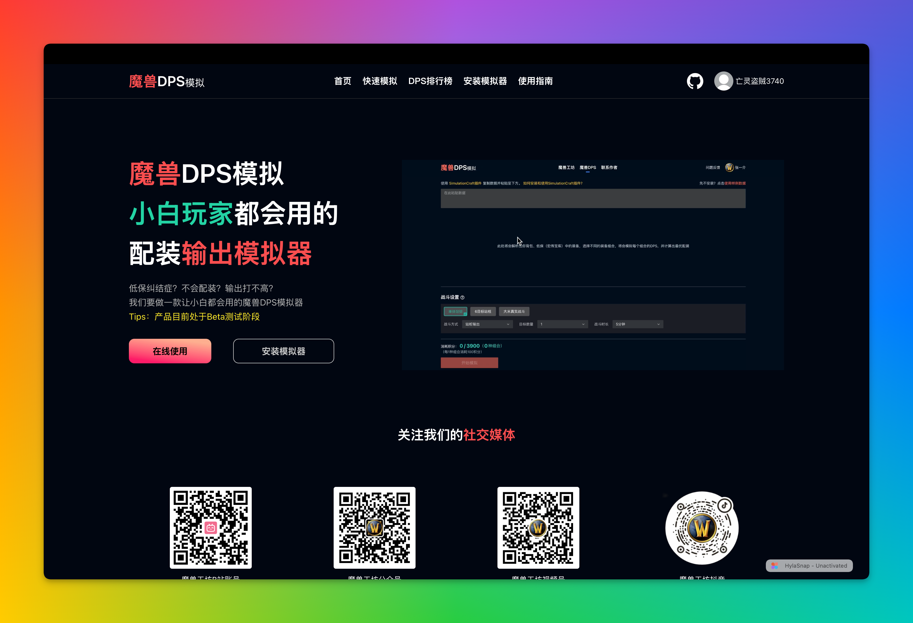
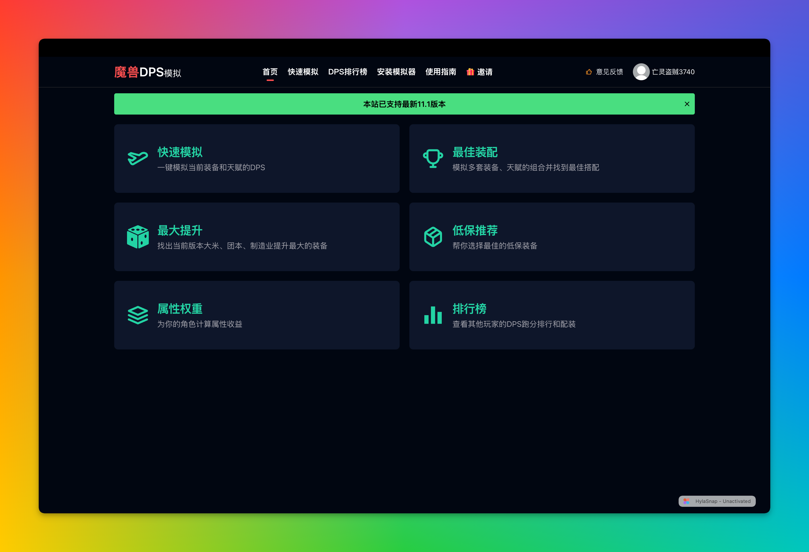
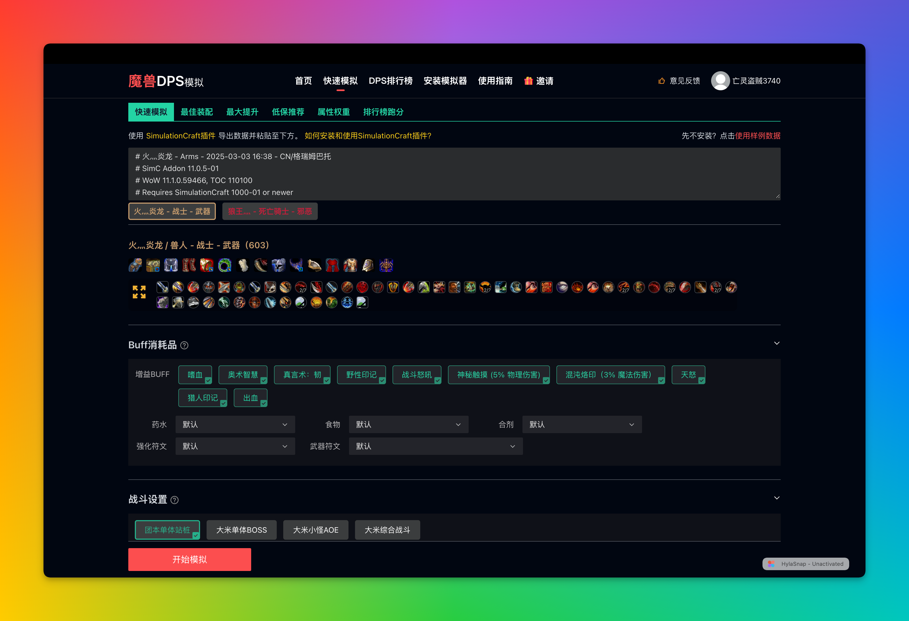
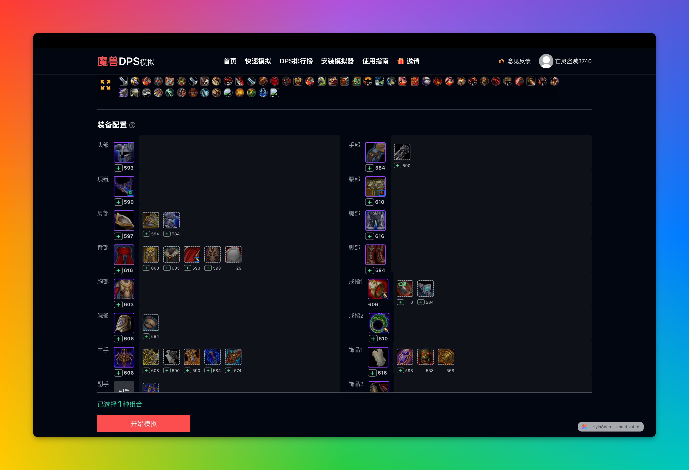
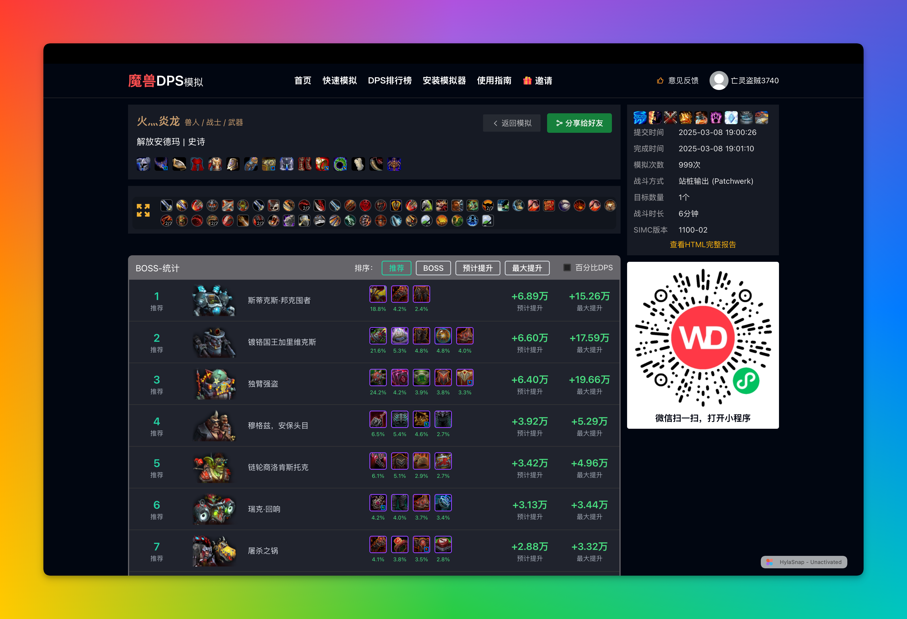
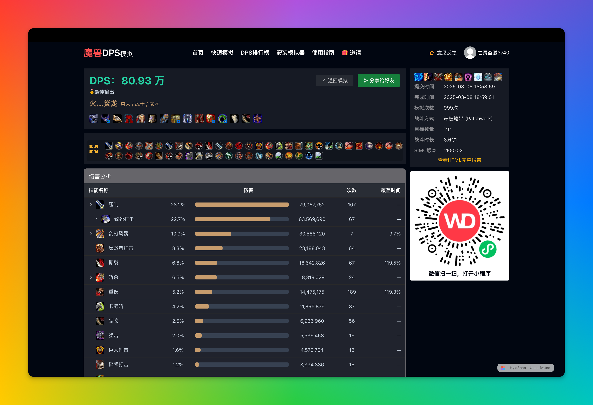

# DPSWoW-Website 🎮⚔️

    

**DPSWoW-Website**项目 是 [魔兽DPS模拟器（dpswow.com）](https://dpswow.com) 的前端网站，主要用于管理战斗设置数据、Buff消耗品等数据。 

## ✨ 功能特性

- ✅ **快速模拟**：一键模拟当前装备和天赋的DPS
- ✅ **最佳装配**：模拟多套装备、天赋的组合并找到最佳搭配
- ✅ **最大提升**：找出当前版本大米、团本、制造业提升最大的装备
- ✅ **低保推荐**：帮你选择最佳的低保装备
- ✅ **属性权重**：为你的角色计算属性收益
- ✅ **排行榜**：查看其他玩家的DPS跑分排行和配装

## 界面预览

### 官网


### 功能导航


### 模拟器


### 角色装备


### 模拟结果





- **多语言支持**：暂不支持。

## 🚀 快速开始

### 二、启动项目

1. 克隆仓库：

   ```bash
   git clone https://github.com/wowgf/DPSWoW-Website.git
   cd DPSWoW-Website
   ```

2. 安装依赖：

   ```bash
   pnpm install  # 或使用 yarn install
   ```

3. 启动本地服务：

   ```bash
   pnpm dev
   ```

4. 访问本地服务：

   ```
   http://localhost:3000
   ```

### 配置

#### 配置请求API

   新建.env

    ```
    VITE_HOST = "http://dev.wowdps.com:7002" // 服务地址

    VITE_OSS_HOST = "custom_oss_url" // 静态资源地址
    ```

### 部署项目

1. 执行命令：

   ``` bash
   pnpm build:prod
   ```
   
2. 部署：

   将dist目录下的文件部署至服务器即可

## 🛠️ 技术栈

- **语言**：JavaScript/TypeScript  
- **框架**：vue.js nuxt3 element-ui arco.design 
- **部署**：Docker + Nginx

## 🤝 贡献指南

我们欢迎任何形式的贡献！无论是代码、文档，还是问题反馈，都可以通过以下方式参与：

1. Fork 仓库并创建分支：

   ```bash
   git checkout -b feature/your-feature
   ```

2. 提交更改并推送：

   ```bash
   git commit -m "添加新功能：xxx"
   git push origin feature/your-feature
   ```

3. 提交 Pull Request，并描述你的更改。

4. 加微信反馈：lwbg66

更多细节请参考 [贡献指南](./docs/CONTRIBUTING.md)。

## 📜 开源协议

本项目采用 ["Commons Clause" + MIT 协议](./LICENSE)，允许自由使用、修改和分发代码，但不允许将本软件用于商业销售。详情请参阅LICENSE文件。

## 🌟 支持与反馈

如果你喜欢这个项目，请点个 ⭐ Star 支持我们！  
如有问题或建议，请提交 [Issues](https://github.com/wowgf/DPSWoW-Admin.git/issues) 或通过邮件联系：<miaoihan@gmail.com>。

## 📌 相关项目

- **DPSWoW 服务端**：核心服务端组件。  
  [GitHub 仓库](https://github.com/wowgf/DPSWoW-Server.git)

- **DPSWoW 前端**：用户界面，提供直观的 DPS 模拟体验。  
  [GitHub 仓库](https://github.com/wowgf/DPSWoW-Website.git)

- **DPSWoW 后台管理端**：用于管理用户、任务和数据分析。  
  [GitHub 仓库](https://github.com/wowgf/DPSWoW-Admin.git)


## 🎉 致谢

感谢以下项目为 WOWDPS 提供的支持：

- [SimulationCraft](https://github.com/simulationcraft/simc)  
- [raidbots](https://www.raidbots.com/)  
- [大秘境](https://www.damijing.com/)
- [Details! Damage Meter](https://www.curseforge.com/wow/addons/details)  
- [Bull.js](https://github.com/OptimalBits/bull)  
- [Node.js](https://nodejs.org)

**WOWDPS-Server** —— 为 **DPSWoW 魔兽 DPS 模拟器** 提供强大的后端支持，助你精准模拟每一场战斗！🎮⚔️

- **贡献者列表**：  

